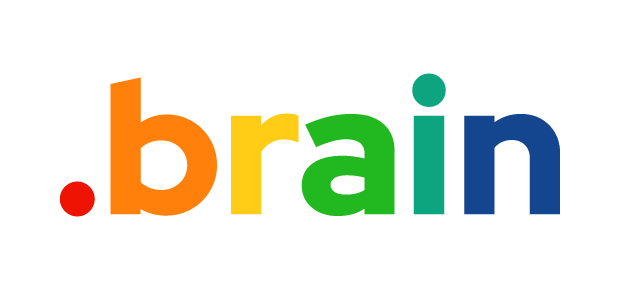
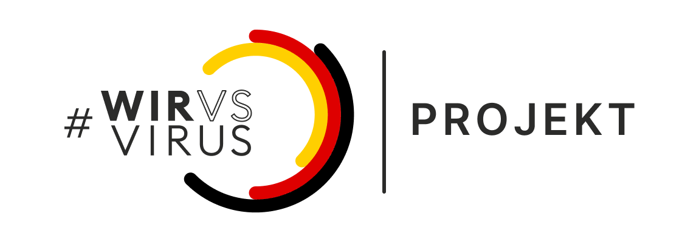

# #WirVsVirus Hackathon Documentation Team .brain

| Project name        | .brain (“DotBrain”)                                          |
| :------------------ | ------------------------------------------------------------ |
| Titel               | A matchmaking platform for knowledge exchange in digital form. |
| Devpost link        | https://devpost.com/software/wodahoam-lockdownlearning (German) |
| GitHub link         | https://github.com/IneffableKoD/wirvsvirus_dotbrain          |
| Product demo        | https://www.youtube.com/watch?v=DacZ04P6K_U (German)         |
| Subject area        | 1_019_e-learning 1_019_e-learinng_mentoringplattform    |
| Beneficiary         | #WirVsVirus Hackathon                                        |
| Team members        | Carolin Glaeser Helena Wollmann Karsten Kreh Lorenz Meier Lynn Fehlbaum Marcel Donges Max Emrich Orlando Jähde Timo Morawitz Yannick Zehnder |
| Dissemination level | Public                                                       |
| Submission          | Sunday, 22.03.2020, 24.00                                    |
| Version             | 0.1                                                          |
| Text license        | This work is licensed under a Creative Commons Attribution-ShareAlike 4.0 International License |
| Software license    | AGPLv3 / cc-enterprise                                       |
| Status              | Work in progress                                             |

## Short description

Did you know that distance learning by digital means is possible, but that knowledge providers and knowledge seekers are poorly connected? In Germany alone, there are over 14.5 million pupils, students, teachers, and lecturers. .brain offers the portal to bring together demand and supply of knowledge transfer in this target group. In contrast to other alternatives, we are focused on making contacts quickly and easily. The team includes creative minds with a wide range of expertise. Essentially, we are eBay for knowledge exchange, and our vision is to shorten paths to digitally mediated knowledge drastically. We have already made a demo of the portal and created first functional components; we invite everyone to push and popularize the product. Covid-19 can't hinder our thirst for knowledge! 

## Team History

We are a diverse team of creative minds from Germany and Switzerland. We are schoolgirls, students, designers, entrepreneurs, researchers, and lateral thinkers. The group has been formed as spontaneously as the project idea in the first brainstorming session. 

The spontaneity and work ethic in the team are exceptional. We want to thank the #WirVsVirusHack for the excellent opportunity to get together for a weekend and do good. 

## .brain Story

The .brain portal is designed to efficiently bring together knowledge seekers (brains) and knowledge brokers (super-brains) ("matchmaking"). For this purpose, a profile is created on a simple input mask, and the skills sought and offered are defined. The portal then links the suitable partners and enables them to exchange information in a chat function (for arranging virtual meetings, telephone calls, etc.). Brains can upload learning materials for which they are looking for support and make them accessible to the super-brains. 

It is essential that the roles of brain and super-brain are fluid. Users can be one or the other, depending on the topic. For example, a student can search for tutoring in mathematics and offer tutoring in Spanish at the same time. 

### .brain User-Stories (fictional)

#### Super-Brain (Caro)

Hey, my name is Caro, and I study design in Munich. Well, right now I'm sitting at home like you probably are too and at my studies, they pressed the pause button. In these challenging times, I would like to support others and make a meaningful contribution with my skills. I draw at home or play the guitar to pass the time. But alone, it is sometimes quite tedious. I miss a meaningful task in everyday life. That's why I now offer tuition in art and music for pupils up to senior high school on .brain. Yesterday I practiced with Hannah (14) one hour of portrait drawing over the webcam, and later I show Tom (12) how to teach himself to play the guitar most easily. I enjoy sharing my knowledge and making it easier for parents and family to live together. You don't have to be an expert in your field to help, but every little contribution is valuable.

*With .brain, I can quickly provide help for brains big and small. But how can I do that from home? That's how I discovered .brain. Here, small and large brains are networked throughout Germany to strengthen our connections in the brain and between all of us.* 

#### Brain (Helena)

Hey, I'm Helena, and I'm about to graduate like many others. Unfortunately, the current situation is disastrous for my preparations. Especially in math, I have a lot of difficulties to work out everything by myself and have to write a complicated e-mail to my teacher for every little question. I am also worried about my oral English exam because nobody in my family has the knowledge to practice with me. Also, the motivation to sit down every day is low. Working in a group could give me more discipline, but dating friends and classmates is not possible at the moment. 

*With .brain, I now can get in contact with experts, students and volunteers. This makes it possible for me to learn effectively in a group with friends.*

#### Brain-Parents (Yannick und Lynn)

Our names are Lynn and Yannick, our son Oscar sits at home and is bored because the school is poorly prepared for the COVID situation. The teachers do not keep up with lessons; the learning contents are not up-to-date and not suitable for digital remote learning. At first, Oscar was happy about the unexpected "holidays," but now he is bored, and he is afraid that he will not be up to speed when the lessons continue.

We both work in our home office and unfortunately have a thousand things on our minds ourselves. We want to refer Oscar to a platform where he can get help from his peers, teachers, and students. 

In his spare time, Oscar plays the drums, but he is also not allowed to go to music lessons, and the music teacher is unfortunately not ready for digital lessons. We would be happy if he could get some help from someone (child or adult) to practice; sadly, we are both unmusical. We hope that Oscar will enjoy learning and maybe even make new friends with whom he can do homework, play the drums, and come through this extraordinary time a little more light-hearted and less isolated. 

*We are happy we found with .brain a portal where our Oscar can do all this. We appreciate the fact that in addition to the educational content, there are also tips for tools available. We always come to the "first lesson" with Oscar to get a brief impression of the "super brain" who does something with him.* 

*We would appreciate it if we could give ratings of the super-brains on Oscar's profile to help others to find the right super-brains and prevent someone from doing ill on the portal.* 

*When we have more time, we would like to offer to contribute to the community as well.*

## .brain Design

The design and logic of .brain is inspired by the human brain. Attractive colours and intuitive interaction were the main focus of the design. 

The shapes and colours of the .brain application are inspired by neuroscientific analysis procedures (magnetic resonance imaging image analysis).

The design is leading in the implementation of the application.

## .brain Development (Software)

Thanks to the contribution of Marcel Donges, the team has access to the "WODA" environment developed by him, with which Web 4.0 applications can be developed in the shortest possible time by efficiently merging existing components. "WODA" is currently in the final stages of the deployment phase for an open-source version. 

------

